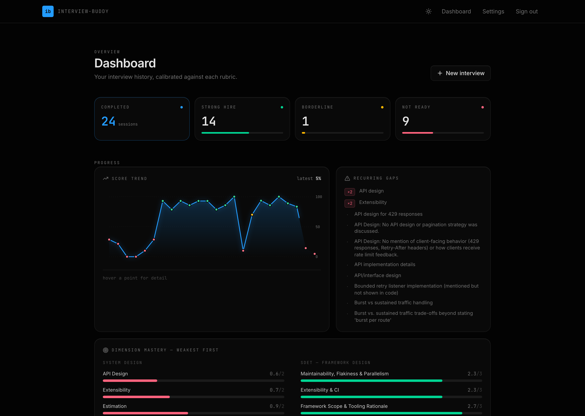
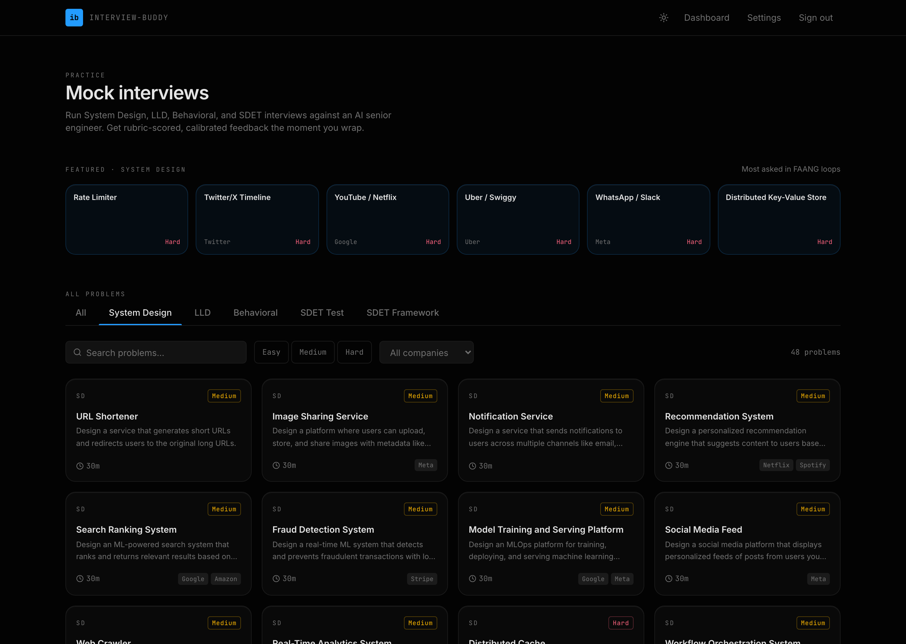
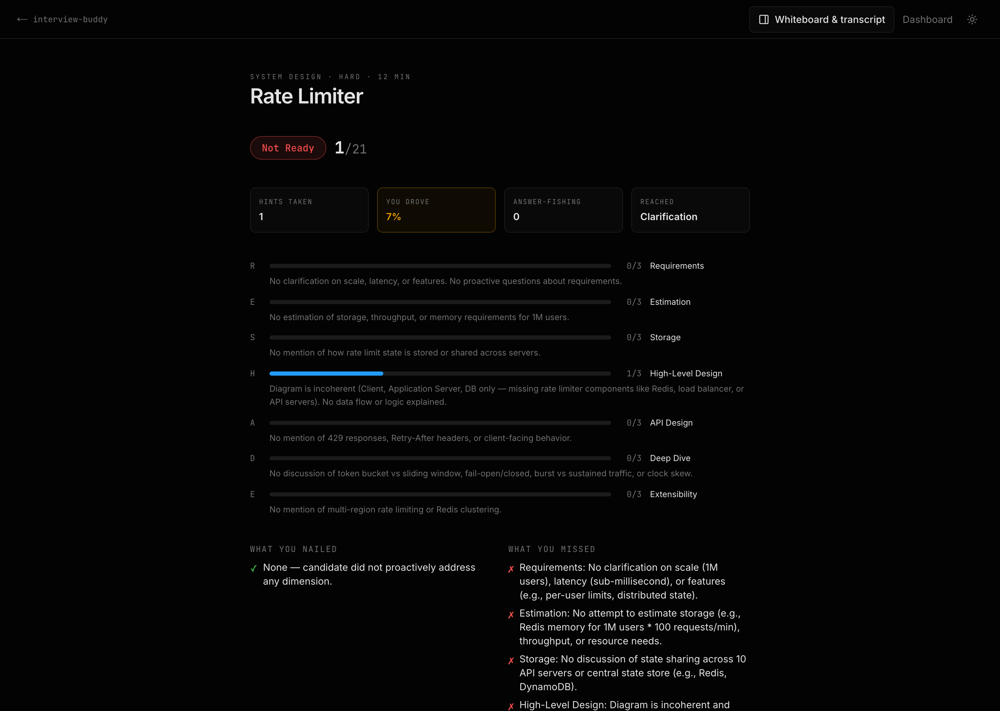

# Interview Buddy

An AI-powered mock-interview platform for senior-engineer prep. Run realistic **System Design**, **Low-Level Design**, **Behavioral**, and **SDET** interviews with an LLM interviewer — complete with a live whiteboard, code editor, structured scoring, and a progress dashboard.

**Live:** [interview-buddy-livid.vercel.app](https://interview-buddy-livid.vercel.app) — sign up and start practicing. Prefer to keep everything on your own infrastructure? [Deploy your own](#deploy-your-own) single-tenant instance in a couple of minutes.

> Bring your own LLM API key (Cerebras, Groq, Mistral, or Gemini). Keys are encrypted at rest with AES-256-GCM and used only to call the provider on your behalf.

---

## Screenshots

**Progress dashboard** — verdict tallies, score trend, dimension mastery, and recurring gaps.



<table>
<tr>
<td width="50%"><b>Problem catalog</b><br/>Browse and filter across five interview types.<br/></td>
<td width="50%"><b>Rubric-scored results</b><br/>Per-dimension scores, what you nailed, and what you missed.<br/></td>
</tr>
</table>

---

## Features

- **Five interview modes** — System Design (split chat + whiteboard), Low-Level Design (chat + code editor), Behavioral (STAR), and SDET Test/Framework Design.
- **Conversational interviewer** — a turn-by-turn LLM interviewer that asks follow-ups, probes trade-offs, and adapts to your answers.
- **Live whiteboard** — an embedded [Excalidraw](https://excalidraw.com) canvas for system-design diagrams, theme-matched and auto-saved. On request, the diagram is sent to the model for targeted feedback.
- **In-browser code editor** — [CodeMirror](https://codemirror.net) with Java / TypeScript / Python / C++ support for LLD sessions.
- **Structured evaluation** — every session is scored across dimensions with a verdict (Strong Hire / Borderline / Not Ready), strengths, and recurring gaps.
- **Progress dashboard** — score trend over time, per-dimension mastery, and recurring weak spots, rendered as a cohesive data-visualization system.
- **Voice (optional)** — text-to-speech for interviewer prompts via Google TTS / the Web Speech API.
- **Multi-provider fallback** — if your primary provider is rate-limited or rejects the key, the request transparently falls through to the next configured provider.
- **Bring-your-own-key** — no central API bill; each user supplies their own provider key in Settings.

---

## Tech Stack

| Layer | Choice |
|---|---|
| Framework | Next.js 16 (App Router, Turbopack), React 19, TypeScript |
| Styling | Tailwind CSS v4, shadcn/ui, a custom "Calibrated" design system |
| Auth & data | Supabase (Postgres + SSR Auth), Row-Level Security |
| LLM providers | Cerebras · Groq · Mistral · Gemini (OpenAI-compatible) + Anthropic |
| Editor / canvas | CodeMirror · Excalidraw |
| Hosting | Vercel |

---

## Security Design

Security was treated as a first-class concern, not an afterthought:

- **API keys encrypted at rest (AES-256-GCM).** User-supplied provider keys are never stored in plaintext. Each key is encrypted with authenticated AES-256-GCM using a per-record random IV; the auth tag and a version marker are stored alongside the ciphertext (`v1:<iv>:<tag>:<ciphertext>`). The 256-bit master key lives **only** in the server environment (`SETTINGS_ENC_KEY`), never in the database. A database leak alone yields ciphertext — recovering a usable key would require compromising **both** the database and the server environment. Decryption happens server-side only, immediately before a provider call.
- **Row-Level Security on every table.** All four tables (`user_settings`, `interview_sessions`, `interview_messages`, `interview_evaluations`) enable Postgres RLS with policies scoped to `auth.uid()`, so a user can only ever read or write their own rows — enforced at the database, not just the app.
- **Authentication via Supabase SSR.** Sessions are validated server-side on protected routes; unauthenticated requests are redirected to login.
- **Hardened HTTP headers.** Production sends a Content-Security-Policy (scoped to the app's own origin plus the Supabase API), HSTS, `X-Frame-Options: DENY`, `X-Content-Type-Options: nosniff`, a strict `Referrer-Policy`, and a locked-down `Permissions-Policy`.

> **Is it safe to store API keys in the database with AES encryption?** Yes — with the design above. Because the keys must be *recovered* to call the provider, hashing isn't an option, so reversible authenticated encryption (AES-256-GCM) is the correct tool. The security rests on keeping the master key out of the database and only in the server environment; under that assumption, encrypted-at-rest storage is a sound, industry-standard approach.

---

## Architecture

```
app/
  api/interview/        message · evaluate · diagram-feedback · canvas · code · speak
  interview/[id]/       live interview shell (chat + whiteboard / code editor)
  dashboard/            progress analytics & session history
  settings/             bring-your-own-key management
lib/
  crypto.ts             AES-256-GCM encrypt/decrypt for stored keys
  llm.ts                multi-provider client with fallback
  scenarios/            interview-type definitions & rubrics
  supabase/             SSR client/server helpers
supabase/schema.sql     tables + RLS policies
```

---

## Getting Started

### Prerequisites

- Node.js 20+
- A [Supabase](https://supabase.com) project (free tier is fine)
- At least one LLM provider key (Cerebras, Groq, Mistral, or Gemini)

### Setup

```bash
git clone https://github.com/ankit789/interview-buddy.git
cd interview-buddy
npm install
```

Create `.env.local`:

```bash
NEXT_PUBLIC_SUPABASE_URL=your-project-url
NEXT_PUBLIC_SUPABASE_ANON_KEY=your-anon-key

# 32-byte key (base64) used to encrypt stored API keys at rest.
# Generate one with:  openssl rand -base64 32
SETTINGS_ENC_KEY=your-32-byte-base64-key

# Optional: server-side TTS
GOOGLE_TTS_API_KEY=your-google-tts-key
```

Apply the database schema (Supabase SQL Editor → paste `supabase/schema.sql`), then:

```bash
npm run dev
```

Open [http://localhost:3000](http://localhost:3000), sign up, add a provider key in **Settings**, and start an interview.

---

## Deploy your own

You can use the [hosted instance](https://interview-buddy-livid.vercel.app) as-is, or run your own private, single-tenant copy where all data and keys live entirely on your own infrastructure.

[](https://vercel.com/new/clone?repository-url=https%3A%2F%2Fgithub.com%2Fankit789%2Finterview-buddy&env=NEXT_PUBLIC_SUPABASE_URL,NEXT_PUBLIC_SUPABASE_ANON_KEY,SETTINGS_ENC_KEY&envDescription=Supabase%20project%20credentials%20%2B%20a%2032-byte%20base64%20key%20for%20encrypting%20stored%20API%20keys)

The button prompts you for the required environment variables on import. Two one-time setup steps it can't do for you:

1. **Create a Supabase project** ([supabase.com](https://supabase.com), free tier is fine) and grab its URL + anon key for `NEXT_PUBLIC_SUPABASE_URL` / `NEXT_PUBLIC_SUPABASE_ANON_KEY`.
2. **Run the schema** — paste `supabase/schema.sql` into the Supabase SQL Editor (this creates the tables and Row-Level Security policies).

Generate `SETTINGS_ENC_KEY` with `openssl rand -base64 32`. Once deployed, open your instance, sign up, add a provider key in **Settings**, and you're running fully on your own stack.

---

## License

[MIT](./LICENSE)
